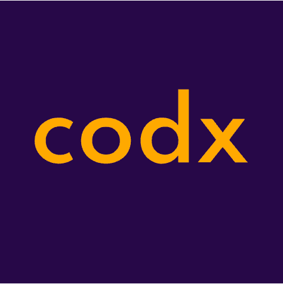

    

This workshop focuses on the practical aspects of time series analysis, modeling, and deploying machine learning models to embedded devices for TinyML applications. We showcase:

    Time Series Analysis: Understanding the structure and patterns of time series data, including concepts like stationarity, autocorrelation, and multicollinearity.

    Time Series Modeling: Implementing forecasting models such as ARIMA, SARIMA, XGBoost, and TensorFlow Decision Forest to make predictions from time series data.

    Exporting Models to C++: Exporting trained models to C++ for inference, with a focus on running these models on embedded devices for real-time predictions in resource-constrained environments.
