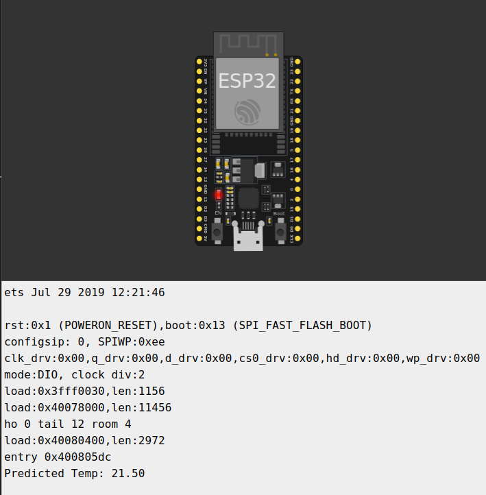

# TinyML TimeSeries Forecasting on ESP32  

This project showcases two different time series forecasting approaches — SARIMAX and XGBoost — implemented and tested independently on an ESP32 microcontroller. The goal is to evaluate classical statistical and machine learning methods for low-power, on-device prediction.

## 🧠 Models Implemented

- **SARIMAX**  
  A classical time series model with seasonal and autoregressive components. C++ implementation performs recursive step-ahead forecasting using trained parameters.

- **XGBoost Regressor**  
  A gradient-boosted tree model trained on lagged time series features and manually ported to C++ for embedded inference.

> Both models are implemented in plain C++ and run directly on the ESP32 without any external ML libraries.
